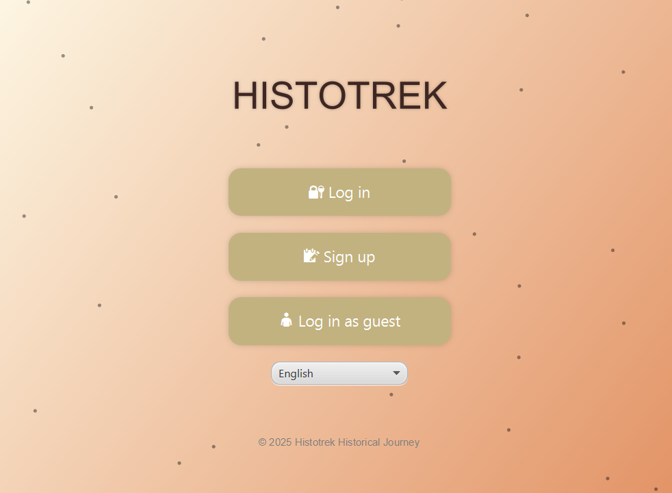

# 🏛️ Histotrek – Historical Places Guide


**Histotrek** is a JavaFX desktop application for managing and exploring historical landmarks with multilingual support, user reviews, rating system, and powerful export/reporting tools.

> Backend database is hosted on **Microsoft Azure** (Azure Database for PostgreSQL / Azure SQL).

---

## 📌 Project Overview

Histotrek allows users to:

- Explore historical sites with detailed descriptions and photos.
- Leave reviews and rate places from ⭐1 to ⭐5.
- Search/filter by country, era, or type.
- Export data to `.docx` and `.xlsx`.
- Generate custom reports (top-rated, popular eras).
- Synchronize data online via API (optional).
- Switch language and theme (light/dark/custom).

---

## 🧱 Core Entities

- **Place** – name, country, era, description, image
- **Review** – rating, comment, date, linked to user & place
- **User** – login, email, role (USER / ADMIN)
- **Report** – auto-generated analytics with export
- **Favorite** – list of places saved by the user

---

## 🌟 Key Features

| Feature             | Description                                             |
|---------------------|---------------------------------------------------------|
| 🔍 Search & Filter   | By country, era, object type                            |
| 📝 Reviews & Ratings | User-submitted comments with 1–5 star ratings           |
| 🖼 Rich Content       | Descriptions, photos, and metadata for each location   |
| 📊 Reports           | Top-rated places, filter by popularity, exportable     |
| 📤 Import/Export     | Excel and Word documents via Apache POI                |
| 🔐 Secure Auth       | Hashed passwords, role-based access, admin tools       |
| 🎨 UI Customization  | Multilingual interface, theming support (3 themes)     |

---

## ☁️ Hosting / Deployment

This project uses:

- **Azure Database for PostgreSQL** (or **Azure SQL**)
- Optionally any other RDBMS: PostgreSQL, MySQL, SQLite

Connection details are stored securely via a `properties` file and managed via a **Connection Pool**.

---

## 🛠 Technologies

- Java 17+
- JavaFX (FXML-based UI)
- JDBC / Hibernate (JPA)
- Apache POI (Excel/DOCX export)
- Retrofit / HttpClient (optional API)
- Microsoft Azure (cloud-hosted DB)
- Maven (build tool)
- Log4j / SLF4J (logging)

---
## 📸 UI Screenshots

<table>
  <tr>
    <td align="center"><strong>Splash Screen</strong></td>
    <td align="center"><strong>Main Menu</strong></td>
    <td align="center"><strong>Guest View</strong></td>
  </tr>
  <tr>
    <td></td>
    <td></td>
    <td></td>
  </tr>
</table>

## 🚀 Getting Started

```bash
git clone https://github.com/your-username/histotrek.git
Set up your database on Azure or locally.

Configure application.properties with DB URL, login, and password.
```
Run the app in your Java IDE or build as .jar / .exe.
```bash
db.url=jdbc:postgresql://your-host-name.postgres.database.azure.com:5432/db_name
db.username=your_username@your-host-name
db.password=your_password
```
🖥 UI Preview
Main screen with grid view of places

Review modal with star rating

Admin tools: user & place management

Report generation + file export

Theme & language switch in settings